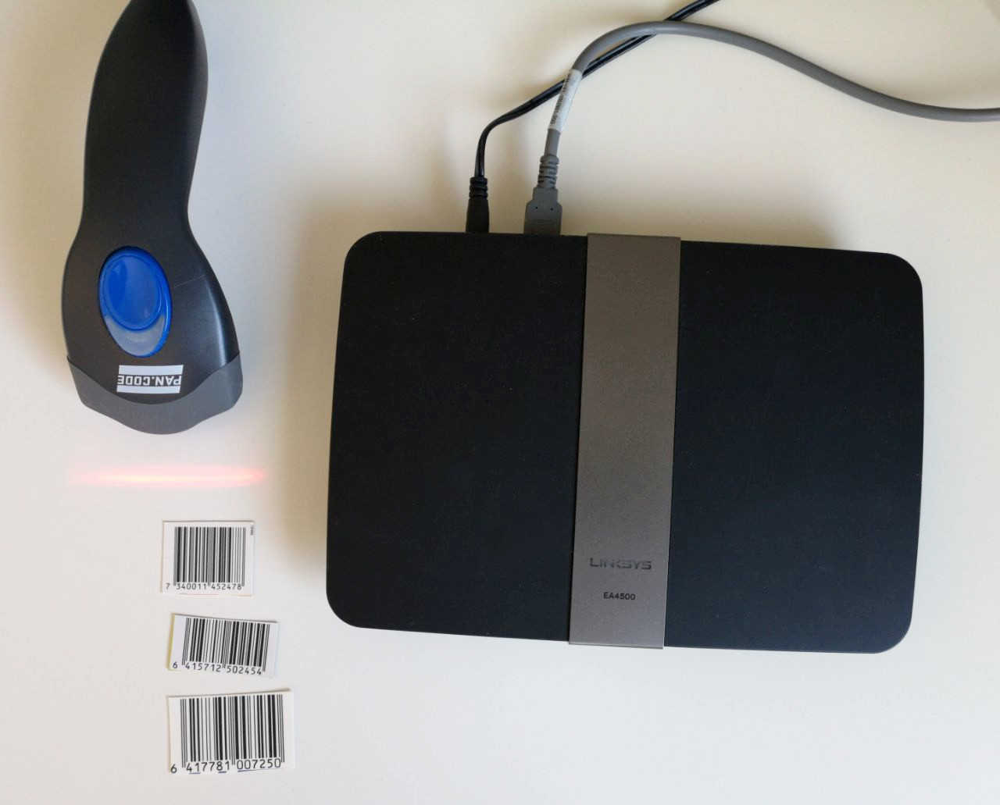

# OPN-Finder

[ES] Control de entrada y salida por medio de un lector de códigos de barras.

[EN] Control of entry and exit through of a barcode reader.

  
<h2>Test tickets</h2>

| Nº ticket   |      Name      |  Print Ticket |
|----------|:-------------:|----------|
| 6417781007250 |  User1 |<a href="https://www.barcodesinc.com/generator/image.php?code=6417781007250&style=197&type=C128B&width=219&height=50&xres=1&font=3">Show<a/>|     
| 6415712502454 |    User2   |<a href="https://www.barcodesinc.com/generator/image.php?code=6415712502454&style=197&type=C128B&width=219&height=50&xres=1&font=3">Show<a/>|

  
<h2>Tips:</h2>

- Change device Timezone if not correct

- Manage to start lector.sh with the system (you can use cron)

- Change admin password

  
<h2>Creating admin password</h2>

- echo superpassword | openssl enc -pbkdf2 -a -salt -pass pass:DT1234

- sqlite3 control.db "UPDATE login SET pass = 'c3VwZXJwYXNzd29yZAo=' WHERE usuario = 'admin'"

  
<h2>Script to install directly from the device</h2>

  
<h6>Telegram group: <a href="http://t.me/openwrt_linux">@openwrt_linux<a/></h6>